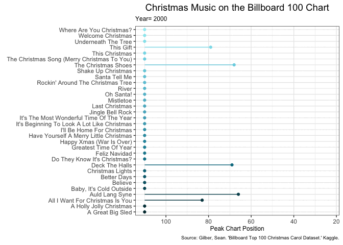

Good Plot, Bad Plot
================
Shelbie Ishimaru
2024-10-16

#### Load Libraries

``` r
# Load libraries ---------------------------------------------------------------
library(here) #for unbreakable file paths
library(tidyverse) #for data manipulation
library(magick) #for advanced image processing in bad plot
library(ggrepel) #adding labels to bad plot
library(RColorBrewer) #bad plot color palette
library(NatParksPalettes) #good plot color palette
library(gganimate) #for animating the good plot
```

#### Load and Inspect the Data

``` r
christmas_songs <- readr::read_csv("https://raw.githubusercontent.com/rfordatascience/tidytuesday/master/data/2019/2019-12-24/christmas_songs.csv") #read in tidy Tuesday Christmas music data
glimpse(christmas_songs) #look at data
```

    ## Rows: 387
    ## Columns: 13
    ## $ url                    <chr> "http://www.billboard.com/charts/hot-100/1958-1…
    ## $ weekid                 <chr> "12/13/1958", "12/20/1958", "12/20/1958", "12/2…
    ## $ week_position          <dbl> 83, 57, 73, 86, 44, 66, 69, 35, 45, 53, 70, 83,…
    ## $ song                   <chr> "RUN RUDOLPH RUN", "JINGLE BELL ROCK", "RUN RUD…
    ## $ performer              <chr> "Chuck Berry", "Bobby Helms", "Chuck Berry", "B…
    ## $ songid                 <chr> "Run Rudolph RunChuck Berry", "Jingle Bell Rock…
    ## $ instance               <dbl> 1, 1, 1, 1, 1, 1, 1, 1, 1, 1, 1, 1, 1, 1, 1, 1,…
    ## $ previous_week_position <dbl> NA, NA, 83, NA, NA, 86, 73, 57, 35, 44, 45, NA,…
    ## $ peak_position          <dbl> 69, 29, 69, 12, 44, 12, 69, 29, 29, 44, 29, 34,…
    ## $ weeks_on_chart         <dbl> 3, 19, 3, 13, 2, 13, 3, 19, 19, 2, 19, 6, 15, 6…
    ## $ year                   <dbl> 1958, 1958, 1958, 1958, 1958, 1958, 1958, 1958,…
    ## $ month                  <dbl> 12, 12, 12, 12, 12, 12, 12, 12, 1, 1, 1, 12, 12…
    ## $ day                    <dbl> 13, 20, 20, 20, 27, 27, 27, 27, 3, 3, 10, 5, 12…

``` r
defrost <- image_read(here("GoodPlot_BadPlot", "Data", "MariahCarey.gif")) %>% #read in bad plot gif
  image_scale("800x") %>% #edit gif size
  image_annotate("She's DEFROSTING", gravity= "South", size= 80) #add text to gif
```

#### Data Manipulation for Bad Plot

``` r
#This code chunk identifies the position of the last year each song was on the Billboard 100 Chart so labels can be added to the plot
last_inst <- christmas_songs %>% #pull in Christmas music data
                    group_by(song, .drop= F) %>% #select songs for data manipulation
  summarise(position= which.max(year), #find the last year each song was on the Billboard chart
            x= year[position], #x position of the label will be the last year the song was on the Billboard chart
            y= peak_position[position]) #y position will be the highest position on the Billboard chart the song reached in it's final year
```

#### Bad Plot

``` r
ncols <- 80 #number of colors needed 
christmas_colors <- colorRampPalette(brewer.pal(11, "RdYlGn"))(ncols) #choose a brewer color and make it so it fits the number of colors needed

badplot <- ggplot(data= christmas_songs, #initialize bad plot 
       mapping= aes(x= year, #x is the year
               y= peak_position, #y is the peak position
               color = song, #color by the song title 
               label= song)) + #label by the song title
  geom_line() + #create a line plot
  scale_color_manual(values= christmas_colors) + #make the colors our specified brewer color palette
  theme(legend.position = "none", #no legend
        plot.title= element_text(face= "bold", hjust= 0.5, size= 30), #bold, center, and increase size of title
        panel.background= element_rect(fill= "lightblue2"), #change panel background light blue
        panel.grid.minor= element_line(color= "lightblue2"), #change panel major grid light blue
        panel.grid.major= element_line(color= "lightblue2"), #change panel minor grid light blue
        axis.title.x= element_text(color= "red"), #make x-axis title red
        axis.text.x = element_text(color= "gold"), #make x-axis values gold
        axis.ticks.x= element_line(color= "green"), #make x-axis ticks green
        axis.title.y= element_text(color= "green"), #make y-axis title green
        axis.text.y = element_text(color= "red"), #make y-axis values red
        axis.ticks.y= element_line(color= "gold"), #make y-axis ticks gold
        text= element_text(family= "Comic Sans MS")) + #make text Comic Sans :)
 geom_label_repel(size= 1.5, data= last_inst, aes(x= x, y= y, label= song)) + #add song labels
  labs(y= "Chart Position", title= "Best Chritmas Music 🎄✨🎶") #add title

ggsave(here("GoodPlot_BadPlot","Outputs","badplot.png")) #save plot

badplot<-image_read(here("GoodPlot_BadPlot","Outputs","badplot.png")) #read in saved bad plot

gif_badplot <- image_composite(badplot, defrost, gravity= "Center") #add gif!
bad_animation <- image_animate(gif_badplot, fps = 10, optimize = TRUE) #animate gif!
bad_animation #look at our wonderful bad plot :)
```

<!-- -->

#### What Makes this a “Bad Plot”?

Below I will discuss why this plot is bad based on Claus Wilke’s
“Fundamentals of Data Visualization” and Kieran Healy’s “Data
Visualization: A Practical Introduction” textbooks:  
1. **Bad Taste:** There is way too much going on with this plot that is
unnecessary and takes away from the data analysis. There are duplicate
labels everywhere, lines connecting geom_lines to labels, spelling
errors, and a random gif in the middle of the plot.  
2. **Perception and Data Visualization:** This plot follows a Christmas
themed color scheme which matches the data, but is horrible for the
audience attempting to view the plot. The red and green color scheme is
not colorblind friendly. The plot its self is already confusing, so not
being able to identify differences between colored lines will make the
plot extremely hard to follow. For all viewers the blue plot background
and yellow text makes if very difficult to read. Finally, there is so
many songs that colors are reused which is likely confusing to the
audience.  
3. **Channels for Representing Data:** This line plot does not truly
tell the viewers the peak position of each song over the years. The lack
of a point at the peak position and no grid lines makes it difficult for
viewers to understand where each songs peak rating actually occurred.
There are also some songs that were only on the Billboard 100 Chart for
one to two years which creates small lines that viewers could easily
mistake for accidental label lines.  
4. **Problems of Honesty and Good Judgement:** The creator of this bad
plot obviously has love for Mariah Carey, and the added gif draws
attention to the song “All I Want for Christmas Is You”. Although it is
difficult to see, there are actually songs that obtained a better
ranking on the Billboard 100 Chart in earlier years.

#### Data Manipulation for Good Plot

``` r
christmas_songs <- christmas_songs %>%  #pull in Christmas music data
  mutate(song= str_to_title(song)) %>%
  filter(year >= 2000) %>% #filter out data from before 2000
  complete(song, year, fill= list(week_position= 110)) %>% #add missing rows so all songs area accounted for every year (set to 110 if created because it means it did not make the Billboard 100)
  group_by(song, year) %>% #select song and year
  summarize(year_peak= max(week_position)) #calculate the highest position a song hit every year
```

#### Good Plot

``` r
christmas_cols <- natparks.pals("Glacier", n=35) #choose a national parks color and make it so it fits the number of colors needed
ifelse(NatParksPalettes::colorblind.friendly("Glacier")== TRUE, paste("This palette is colorblind friendly :)"), paste("This palette is NOT colorblind friendly :(")) #make sure that this palette is colorblind friendly
```

    ## [1] "This palette is colorblind friendly :)"

``` r
  ggplot(christmas_songs, aes(x= year_peak, y= song, color= song)) + #create ggplot, set axes and plot by song
  geom_point(stat= "identity") + #use y variable for the dependent variable 
  scale_x_reverse() +
  geom_segment(aes( #create segment 
    x= 110, #x segment begins at 0
    y = song, #y segment begins inline with the corresponding song title
    yend = song, #y segment ends inline with the corresponding song title
    xend = year_peak)) + #x segment ends with the peak position for the specified year
  scale_color_manual(values= christmas_cols) + #make colors the national parks glacier that's specified above
  transition_time(year) + #make the animation transition by year
  ease_aes("cubic-in") + 
  labs(title= "Christmas Music on the Billboard 100 Chart", #set title
       subtitle= "Year= {round(frame_time, 0)}", #add subtitle that displays the current year for the animation
       x= "Peak Chart Position", #set x-axis label
       y= "", #no x-axis label because of the lengthy song titles
       caption= "Source: Gilber, Sean. 'Billboard Top 100 Christmas Carol Dataset.' Kaggle.") + #add caption that gives credit to data source
  theme_bw() + #change theme so we have a white background with grey grid lines and black outline
    theme(axis.title= element_text(size= 9), #change axes text size
        plot.title= element_text(hjust= 0.5, face= "bold", size= 14), #change text size, bold text, and center title
        plot.subtitle= element_text(size= 9), #change text size of subtitle
        plot.caption= element_text(size= 7), #change text size of caption
        plot.caption.position = "plot", #change position of caption
        legend.position = "None") #make caption on the bottom right of the page
```

<!-- -->

#### What Makes this a “Good Plot”?

Below I will discuss why this plot is good based on Claus Wilke’s
“Fundamentals of Data Visualization” and Kieran Healy’s “Data
Visualization: A Practical Introduction” textbooks:  
1. **Good Taste:** This is a clean plot that is focused on the data
analysis at hand. There is only one line associated with each song and a
moving point that conveys the song’s peak position on the chart for each
year. The y-axis labels each song so the viewers can easily identify the
rankings of each song. There are also no spelling errors, and the case
of the song titles have been changed from all uppercase to only
capitalizing the start of each word. The data was cut to only show songs
from 2000-2017 to ensure the plot was not overloaded with songs.  
2. **Perception and Data Visualization:** The color scheme chosen for
this plot is colorblind friendly, while maintaining a fun winter color
scheme (blue for winter and snow!). When choosing the color palette I
attempted to ensure that the colors would not become too light to be
difficult to read against a white background.  
3. **Channels for Representing Data:** This animated lollipop plot shows
viewers exactly where each song fell on the Billboard 100 chart each
year. Songs that did not have a Billboard ranking for the year were
given a peak rating of 110, because it shows that they did not make it
within the top 100. I chose to make sure each song had a yearly ranking
because the animation would be too sporadic and difficult to follow. The
subtitle at the top showing the current year also helps viewers
visualize how each song ranked by year.  
4. **Honesty and Good Judgement:** There is no apparent author bias
within the plot, because the plot strictly contains song titles and peak
Billboard 100 Chart position over the years. The author also shows good
academic honesty by creating a caption to give credit to the data
source.
