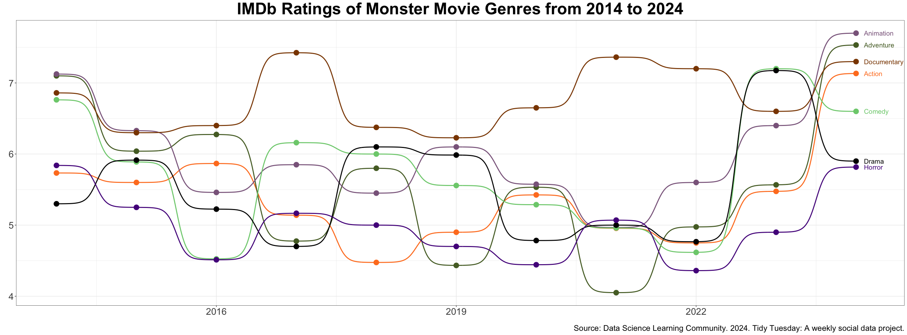

Tidy Tuesday 2
================
Shelbie Ishimaru
2024-11-06

**IMPORTNAT NOTE:** I am so sorry about my confusion and using the
incorrect data set for my first tidy Tuesday assignment. For this
assignment I followed Dr. Silbiger’s instruction and used the Halloween
Movie data set. Then next week I will utilize the ISO data set to be
back in the correct order.

#### What I learned this week!

This week I learned how to create a bump chart to show how different
genres of Monster movies ranked over the last ten years. When creating a
bump chart I learned that they look better with a smaller time frame,
which lead me to cut the data from 1925-2024 to 2014-2024. I also
learned that these charts look better of no ranking data is missing, so
I chose to remove genres that were missing annual average rankings from
2014-2024.

#### Load Libraries

``` r
library(tidyverse) #for data manipulation
library(ggbump) #to create a bump plot
```

#### Read-in Data

``` r
monster_movie_genres <- readr::read_csv('https://raw.githubusercontent.com/rfordatascience/tidytuesday/master/data/2024/2024-10-29/monster_movie_genres.csv') #read in df that states every movies top genre

monster_movies <- readr::read_csv('https://raw.githubusercontent.com/rfordatascience/tidytuesday/master/data/2024/2024-10-29/monster_movies.csv') #read in df with information on each movie
```

#### Data Manipulation

``` r
monster_movies <- monster_movies %>% #pull in movie data
  select(tconst, year, title_type, original_title, average_rating) %>% #select columns we want to keep to complete our join
  left_join(monster_movie_genres) %>% #join movie data with the genre data (using the tconst column)
  group_by(genres, year) %>% #group the columns we want to calculate average
  summarise(rating= mean(average_rating)) %>% #calculate the averaage ranking for each genre
  filter(genres %in% c("Action", "Adventure", "Animation", "Comedy", "Documentary", "Drama", "Horror")) %>% #keep only the columns we want (have data from 2014-2024)
  filter(year >= 2014) %>% #remove unwanted years (we only want the last 10)
  na.omit() #remove any NAs
```

#### Create Plot

``` r
ggplot(monster_movies, aes(x= year, y= rating, color= genres)) + #make a plot and group by move genre
  geom_bump(size= 1) + #make a bump plot and increase the line size
  geom_point(size= 5) + #increase the point size so we can see how each genre ranks every year
  geom_text(data = monster_movies %>% filter(year == max(year)), #add genre label and the end of the plot
            aes(x = year + 0.1, label = genres), #add genre label and the end of the plot
            size = 5, hjust = 0) + #add genre label and the end of the plot
  labs(title= "IMDb Ratings of Monster Movie Genres from 2014 to 2024", #add plot title
       x= "", #remove x-axis title
       y= "", #remove y-axis title
       caption= "Source: Data Science Learning Community. 2024. Tidy Tuesday: A weekly social data project.") + #add caption to provide citation
  theme_bw() + #change theme so we have a white background with grey grid lines and black outline
    theme(legend.position = "none", #remove legend
      plot.title= element_text(hjust= 0.5, face= "bold", size= 35), #change text size, bold text, and center title
      axis.text= element_text(size= 20), #change size of axis values
      plot.caption= element_text(size= 17), #change text size of caption
      plot.caption.position = "plot") + #make caption on the bottom right of the page
  scale_color_manual(values= c("chocolate1", "darkolivegreen", "plum4", "palegreen3", "darkorange4", "black", "purple4")) #add Halloween colors!
```

<!-- -->
