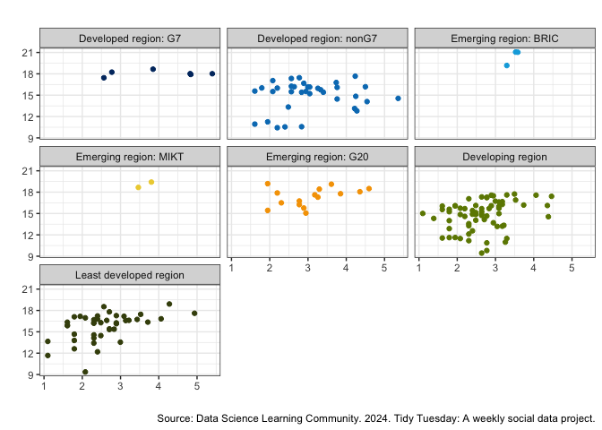
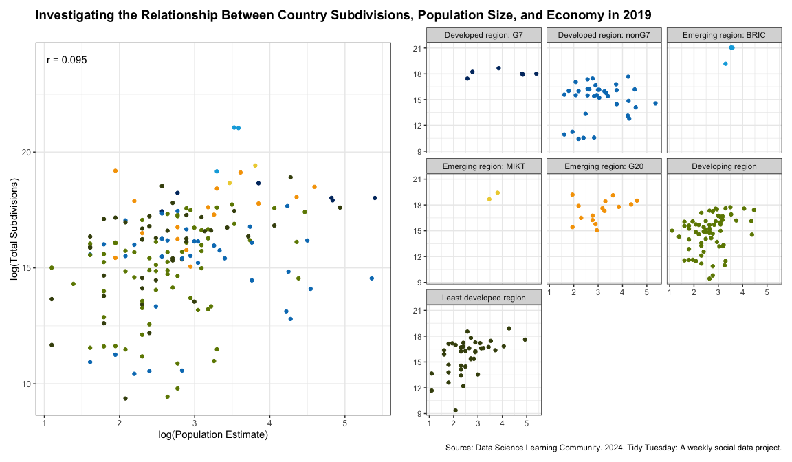

Tidy Tuesday 3
================
Shelbie Ishimaru
2024-11-09

#### What I learned this week!

This week I learned about a fun color palette called
[feathers](https://github.com/shandiya/feathers) that is based off of
female Australian bird plumage. I also learned how to calculate
Pearson’s Correlation Coefficient in R and add the result to a scatter
plot. Finally I used the patchwork package that we learned about in week
8 to combined two plots.

#### Load Libraries

``` r
library(rnaturalearth) #for creating maps
library(rnaturalearthdata) #for creating maps 
library(tidyverse) #for data manipulation
library(countries) #for creating maps
library(patchwork) #for joining plots
library(feathers) #a fun color palette based on female Australian bird plumage
```

#### Read-in Data

``` r
countries <- readr::read_csv('https://raw.githubusercontent.com/rfordatascience/tidytuesday/master/data/2024/2024-11-12/countries.csv') #read in country data

country_subdivisions <- readr::read_csv('https://raw.githubusercontent.com/rfordatascience/tidytuesday/master/data/2024/2024-11-12/country_subdivisions.csv') #read in country subdivision data

world <- ne_countries(scale = "medium", returnclass = "sf") #read in world data 
#head(world) #look at data, commented out because its a large df
```

#### Data Manipulation

``` r
world <- world %>% #pull in world data
  filter(pop_year== 2019) %>% #subset data to only include 2019 instances
  mutate(economy= str_replace(economy, "1. Developed region: G7", "Developed region: G7")) %>% #edit wording for final plot
  mutate(economy= str_replace(economy, "2. Developed region: nonG7", "Developed region: nonG7")) %>% #edit wording for final plot
  mutate(economy= str_replace(economy, "3. Emerging region: BRIC", "Emerging region: BRIC")) %>% #edit wording for final plot
  mutate(economy= str_replace(economy, "4. Emerging region: MIKT", "Emerging region: MIKT")) %>% #edit wording for final plot
  mutate(economy= str_replace(economy, "5. Emerging region: G20", "Emerging region: G20")) %>% #edit wording for final plot
  mutate(economy= str_replace(economy, "6. Developing region", "Developing region")) %>% #edit wording for final plot
  mutate(economy= str_replace(economy, "7. Least developed region", "Least developed region")) %>% #edit wording for final plot
  mutate(economy= factor(economy, levels= c("Developed region: G7", "Developed region: nonG7", "Emerging region: BRIC", "Emerging region: MIKT", "Emerging region: G20", "Developing region", "Least developed region"))) #edit wording for final plot

country_data <- country_subdivisions %>% #pull in country subdivision data
  group_by(alpha_2) %>% #group instances by country
  summarise(total_subdivs= n()) %>% #calculate each countries total subdivisions
  left_join(countries) %>% #join subdivision with country data
  rename(admin= name) %>% #rename the column for 2nd join
  inner_join(world) %>% #join country data with world data
  select(admin, total_subdivs, pop_est, economy) #select only the columns we want for analysis
```

#### Data Analysis

``` r
r <- cor.test(country_data$total_subdivs, country_data$pop_est) #run Pearson's correlation test
r #look at result
```

    ## 
    ##  Pearson's product-moment correlation
    ## 
    ## data:  country_data$total_subdivs and country_data$pop_est
    ## t = 1.2327, df = 168, p-value = 0.2194
    ## alternative hypothesis: true correlation is not equal to 0
    ## 95 percent confidence interval:
    ##  -0.05664199  0.24174863
    ## sample estimates:
    ##        cor 
    ## 0.09467944

#### Create Plot

``` r
plot1 <- ggplot(country_data, aes(x= log(total_subdivs), y= log(pop_est), color= economy)) + #create plot 
  geom_point() + #make it a scatter plot
  labs(title= "Investigating the Relationship Between Country Subdivisions, Population Size, and Economy in 2019", #add plot title
       x= "log(Population Estimate)", #add x-axis title
       y= "log(Total Subdivisions)") + #add y-axis title
  scale_color_manual(values= get_pal("bee_eater")) + #a fun color palette based on female Australian bird plumage
  theme_bw() + #change theme so we have a white background with grey grid lines and black outline
  theme(legend.position = "none", #remove legend
      plot.title= element_text(face= "bold", size= 14), #change text size and bold title
      axis.text= element_text(size= 9), #change size of axis values
      plot.caption= element_text(size= 7)) + #change text size of caption
  annotate("text", x= 1.3, y= 24, label= paste0("r = ", round(r$estimate, 3)), color= "black") #add Pearson's r value to the top corner 
plot1
```

<!-- -->

``` r
plot2 <- ggplot(country_data, aes(x= log(total_subdivs), y= log(pop_est), color= economy)) +  #create plot 
  geom_point() + #make it a scatter plot
  facet_wrap(~economy) + #make an individual plot by economic class
  scale_color_manual(values= get_pal("bee_eater")) + #a fun color palette based on female Australian bird plumage
  labs(title= "", #remove plot title
       x= "", #remove x-axis title
       y= "", #remove y-axis title
       caption= "Source: Data Science Learning Community. 2024. Tidy Tuesday: A weekly social data project.") + #add caption that gives data credit
  theme_bw() + #change theme so we have a white background with grey grid lines and black outline
  theme(legend.position = "none") #remove legend
plot2
```

<!-- -->

``` r
plot1 + plot2 #join the two plots together to create the final plot
```

<!-- -->
