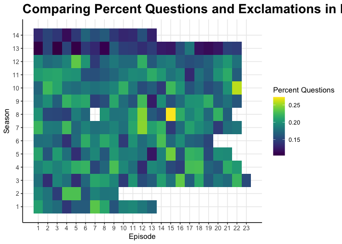
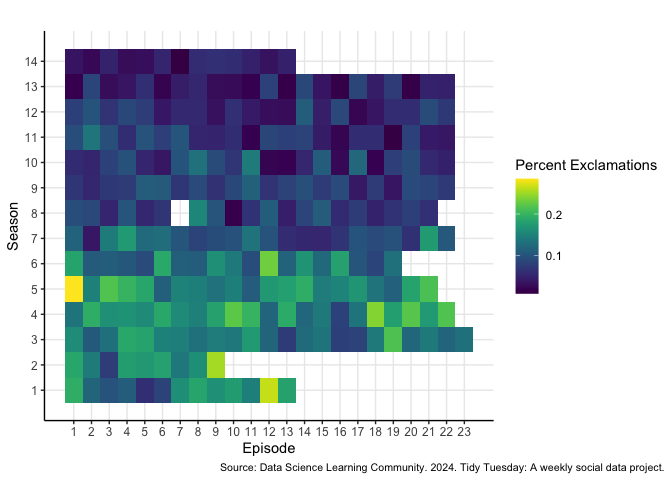
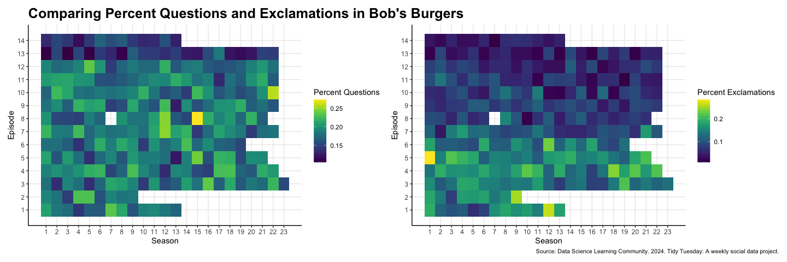

Tidy Tuesday 4
================
Shelbie Ishimaru
2024-11-22

#### What I learned this week!

This week I learned about creating heat maps. Using ggplot, I learned
how to utilize geom_tile to create heat maps as a new form of data
visualization. Along with geom_tile, I also learned how to utilize the
viridis color palette to enhance my heat maps.

#### Load Libraries

``` r
library(tidyverse) #for data manipulation
library(patchwork) #for joining plots
library(viridis) #A fun color palette
```

#### Read-in Data

``` r
bb_words <- readr::read_csv('https://raw.githubusercontent.com/rfordatascience/tidytuesday/master/data/2024/2024-11-19/episode_metrics.csv') #read in bob's burgers episode words data
```

#### Create Plot

``` r
questions <- ggplot(bb_words, aes(x= episode, y= season, fill= question_ratio)) + #initialize question plot
  geom_tile() + #make it a heatmap
  scale_y_continuous(breaks= seq(1, 14, by= 1)) + #make breaks of y-axis by 1
  scale_x_continuous(breaks= seq(1, 23, by= 1)) + #make breaks of x-axis by 1
  scale_fill_viridis() + #fill heatmap with the viridis color palette
  labs(title= "Comparing Percent Questions and Exclamations in Bob's Burgers", #add plot title, NOTE: it's cut off right now because it is suppose to fit the joined patchwork plot
       x= "Episode", #add x-axis title
       y= "Season", #add y-axis title
       fill= "Percent Questions") + #add legend title
  theme_bw() + #nice simple theme
  theme(plot.title= element_text(face= "bold", size= 19), #change text size and bold title
        axis.text= element_text(size= 9), #change axis text size
        axis.line = element_line(color='black'), #make dark gird line next to axis
        plot.background = element_blank(), #make background blank
        panel.grid.minor = element_blank(), #remove minor grid lines
        panel.border = element_blank()) #make boarder blank

questions #display the plot
```

<!-- -->

``` r
exclamations <- ggplot(bb_words, aes(x= episode, y= season, fill= exclamation_ratio)) + #initialize exclamation plot
  geom_tile() + #make it a heatmap
  scale_y_continuous(breaks= seq(1, 14, by= 1)) + #make breaks of y-axis by 1
  scale_x_continuous(breaks= seq(1, 23, by= 1)) + #make breaks of x-axis by 1
  scale_fill_viridis() + #fill heatmap with the viridis color palette
  labs(title= "", #remove plot title
       x= "Episode", #add x-axis title
       y= "Season", #add y-axis title
       fill= "Percent Exclamations", #add legend title
       caption= "Source: Data Science Learning Community. 2024. Tidy Tuesday: A weekly social data project.") + #add caption that gives data credit
  theme_bw() + #nice simple theme
  theme(plot.caption= element_text(size= 8), #change caption text size and bold title
        axis.text= element_text(size= 9), #change axis text size
        axis.line = element_line(color='black'), #make dark gird line next to axis
        plot.background = element_blank(), #make background blank
        panel.grid.minor = element_blank(), #remove minor grid lines
        panel.border = element_blank(), #make boarder blank
        plot.caption.position = "plot") #make the caption in the bottom right corner

exclamations #display the plot
```

<!-- -->

``` r
questions + exclamations #join two plots together to create final plot
```

<!-- -->
