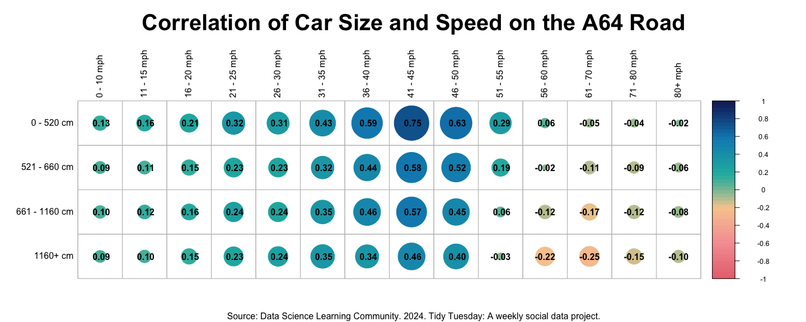

Tidy Tuesday 6
================
Shelbie Ishimaru
2024-11-27

#### What I learned this week!

This week I learned how to create a correlation plot using corrplot
function. When looking at the A64 traffic data I wanted to look at the
correlation between speed and vehicle size. While building the corrplot,
I challenged myself to try the different “methods” and ultimately ended
up with a combination of the circle method and displaying the
correlation values.

#### Load Libraries

``` r
library(tidyverse) #for data manipulation
library(corrplot) #to create correlation plot
library(LaCroixColoR) #a fun color palette
```

#### Read-in Data

``` r
A64_traffic <- readr::read_csv('https://raw.githubusercontent.com/rfordatascience/tidytuesday/master/data/2024/2024-12-03/A64_traffic.csv') #read in traffic data
```

#### Data Manipulation

``` r
#create a dataframe that just has the vehicle size data
car_size <- A64_traffic %>% #pull in A64 traffic data
  select("0 - 520 cm", "521 - 660 cm", "661 - 1160 cm", "1160+ cm") #select the columns of interest
car_size #look at this dataframe
```

    ## # A tibble: 11,904 × 4
    ##    `0 - 520 cm` `521 - 660 cm` `661 - 1160 cm` `1160+ cm`
    ##           <dbl>          <dbl>           <dbl>      <dbl>
    ##  1            9              0               0          1
    ##  2            5              0               0          1
    ##  3            5              0               1          0
    ##  4            4              0               3          0
    ##  5            2              0               0          0
    ##  6            3              0               1          2
    ##  7            2              0               3          3
    ##  8            0              0               1          0
    ##  9            1              0               0          1
    ## 10            1              0               0          0
    ## # ℹ 11,894 more rows

``` r
#create a dataframe that just has the vehicle speed data
car_speed <- A64_traffic %>% #A64_traffic %>% #pull in A64 traffic data
  select("0 - 10 mph", "11 - 15 mph", "16 - 20 mph", "21 - 25 mph", "26 - 30 mph", "31 - 35 mph", "36 - 40 mph", "41 - 45 mph", "46 - 50 mph", "51 - 55 mph", "56 - 60 mph", "61 - 70 mph", "71 - 80 mph", "80+ mph") #select the columns of interest
car_speed #look at this dataframe
```

    ## # A tibble: 11,904 × 14
    ##    `0 - 10 mph` `11 - 15 mph` `16 - 20 mph` `21 - 25 mph` `26 - 30 mph`
    ##           <dbl>         <dbl>         <dbl>         <dbl>         <dbl>
    ##  1            0             0             0             0             2
    ##  2            0             0             0             0             1
    ##  3            0             0             0             0             2
    ##  4            0             0             0             0             1
    ##  5            0             0             0             0             0
    ##  6            0             0             0             0             1
    ##  7            0             0             0             0             0
    ##  8            0             0             0             0             0
    ##  9            0             0             0             0             1
    ## 10            0             0             0             0             0
    ## # ℹ 11,894 more rows
    ## # ℹ 9 more variables: `31 - 35 mph` <dbl>, `36 - 40 mph` <dbl>,
    ## #   `41 - 45 mph` <dbl>, `46 - 50 mph` <dbl>, `51 - 55 mph` <dbl>,
    ## #   `56 - 60 mph` <dbl>, `61 - 70 mph` <dbl>, `71 - 80 mph` <dbl>,
    ## #   `80+ mph` <dbl>

``` r
#run correlation
cor_test <- cor(car_size, car_speed, use= "pairwise.complete.obs") #run correlation on the two dataframes
cor_test #look at this correlation dataframe
```

    ##               0 - 10 mph 11 - 15 mph 16 - 20 mph 21 - 25 mph 26 - 30 mph
    ## 0 - 520 cm    0.13367073   0.1604946   0.2106157   0.3213411   0.3095472
    ## 521 - 660 cm  0.09359109   0.1087393   0.1519851   0.2310752   0.2277014
    ## 661 - 1160 cm 0.10092782   0.1237754   0.1617762   0.2420391   0.2386461
    ## 1160+ cm      0.09078350   0.1020488   0.1531717   0.2336366   0.2441197
    ##               31 - 35 mph 36 - 40 mph 41 - 45 mph 46 - 50 mph 51 - 55 mph
    ## 0 - 520 cm      0.4251025   0.5948309   0.7519391   0.6322302  0.29451938
    ## 521 - 660 cm    0.3228944   0.4430786   0.5796040   0.5216404  0.19127583
    ## 661 - 1160 cm   0.3543672   0.4572291   0.5689039   0.4482756  0.06488525
    ## 1160+ cm        0.3532169   0.3415745   0.4576563   0.3951869 -0.03164994
    ##               56 - 60 mph 61 - 70 mph 71 - 80 mph     80+ mph
    ## 0 - 520 cm     0.06014885 -0.04538265 -0.04442803 -0.02320960
    ## 521 - 660 cm  -0.01821184 -0.10539544 -0.08739754 -0.05532385
    ## 661 - 1160 cm -0.11890969 -0.17212467 -0.11613228 -0.07755039
    ## 1160+ cm      -0.22349203 -0.25106763 -0.15382824 -0.09863926

#### Create Plot

``` r
cor_plot <- corrplot(cor_test, #create corrplot
                     method= "circle", #show correlation in circles
                     col= lacroix_palette("Pamplemousse", n = 50, type = "continuous"), #use fun color palette
                     tl.col= "black", #make "axis" labels black
                     addCoef.col = "black", #add correlation values, in black
                     mar= c(1, 1, 2, 1)) #format the plot (to add title and caption)
title(main= "Correlation of Car Size and Speed on the A64 Road", cex.main= 2.5, sub= "Source: Data Science Learning Community. 2024. Tidy Tuesday: A weekly social data project.") #supply title, title size, and caption
```

<!-- -->
