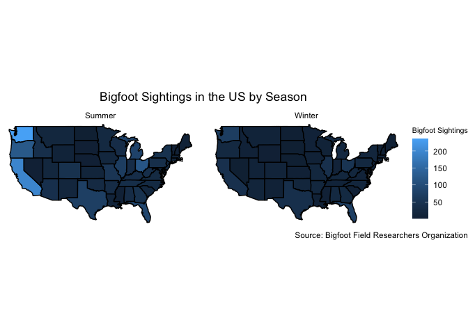

Week 7 Homework
================
Shelbie Ishimaru
2024-10-14

Today were gonna run through how to make a basic plot using Bigfoot
Field Researchers Organization’s Bigfoot data from Tidy Tuesday.

#### Load Libraries

First let’s load libraries that will let us accomplish our goals

``` r
library(tidyverse) 
library(maps)
library(mapdata)
library(mapproj)
```

#### Load and Inspect the Data

Next lets load our data.

``` r
bigfoot <- readr::read_csv('https://raw.githubusercontent.com/rfordatascience/tidytuesday/master/data/2022/2022-09-13/bigfoot.csv') #read in bigfoot data from tidy tuesday
glimpse(bigfoot) #look at bigfoot data
```

    ## Rows: 5,021
    ## Columns: 28
    ## $ observed           <chr> "I was canoeing on the Sipsey river in Alabama. It …
    ## $ location_details   <chr> NA, "East side of Prince William Sound", "Great swa…
    ## $ county             <chr> "Winston County", "Valdez-Chitina-Whittier County",…
    ## $ state              <chr> "Alabama", "Alaska", "Rhode Island", "Pennsylvania"…
    ## $ season             <chr> "Summer", "Fall", "Fall", "Summer", "Spring", "Fall…
    ## $ title              <chr> NA, NA, "Report 6496: Bicycling student has night e…
    ## $ latitude           <dbl> NA, NA, 41.45000, NA, NA, 35.30110, 39.38745, 41.29…
    ## $ longitude          <dbl> NA, NA, -71.50000, NA, NA, -99.17020, -81.67339, -7…
    ## $ date               <date> NA, NA, 1974-09-20, NA, NA, 1973-09-28, 1971-08-01…
    ## $ number             <dbl> 30680, 1261, 6496, 8000, 703, 9765, 4983, 31940, 56…
    ## $ classification     <chr> "Class B", "Class A", "Class A", "Class B", "Class …
    ## $ geohash            <chr> NA, NA, "drm5ucxrc0", NA, NA, "9y32z667yc", "dpjbj6…
    ## $ temperature_high   <dbl> NA, NA, 78.17, NA, NA, 71.86, NA, 92.24, NA, NA, 74…
    ## $ temperature_mid    <dbl> NA, NA, 73.425, NA, NA, 61.425, NA, 80.810, NA, NA,…
    ## $ temperature_low    <dbl> NA, NA, 68.68, NA, NA, 50.99, NA, 69.38, NA, NA, 53…
    ## $ dew_point          <dbl> NA, NA, 65.72, NA, NA, 51.03, NA, 67.34, 32.55, NA,…
    ## $ humidity           <dbl> NA, NA, 0.86, NA, NA, 0.79, NA, 0.68, 0.45, NA, 0.7…
    ## $ cloud_cover        <dbl> NA, NA, 0.86, NA, NA, 0.11, NA, 0.05, 0.00, NA, 0.6…
    ## $ moon_phase         <dbl> NA, NA, 0.16, NA, NA, 0.07, NA, 0.76, 0.02, NA, 0.1…
    ## $ precip_intensity   <dbl> NA, NA, 0.0000, NA, NA, NA, NA, 0.0000, 0.0000, NA,…
    ## $ precip_probability <dbl> NA, NA, 0.00, NA, NA, NA, NA, 0.00, 0.00, NA, 0.70,…
    ## $ precip_type        <chr> NA, NA, NA, NA, NA, "rain", NA, NA, NA, NA, "rain",…
    ## $ pressure           <dbl> NA, NA, 1020.61, NA, NA, 1017.26, NA, 1016.80, 1012…
    ## $ summary            <chr> NA, NA, "Foggy until afternoon.", NA, NA, "Partly c…
    ## $ uv_index           <dbl> NA, NA, 4, NA, NA, 7, NA, 8, 8, NA, 6, 10, 6, 7, NA…
    ## $ visibility         <dbl> NA, NA, 2.750, NA, NA, 10.000, NA, 6.922, 8.880, NA…
    ## $ wind_bearing       <dbl> NA, NA, 198, NA, NA, 259, NA, 219, 285, NA, 262, 19…
    ## $ wind_speed         <dbl> NA, NA, 6.92, NA, NA, 8.41, NA, 1.01, 4.01, NA, 0.4…

``` r
states <- map_data("state") #get state data
glimpse(states) #look at state data
```

    ## Rows: 15,537
    ## Columns: 6
    ## $ long      <dbl> -87.46201, -87.48493, -87.52503, -87.53076, -87.57087, -87.5…
    ## $ lat       <dbl> 30.38968, 30.37249, 30.37249, 30.33239, 30.32665, 30.32665, …
    ## $ group     <dbl> 1, 1, 1, 1, 1, 1, 1, 1, 1, 1, 1, 1, 1, 1, 1, 1, 1, 1, 1, 1, …
    ## $ order     <int> 1, 2, 3, 4, 5, 6, 7, 8, 9, 10, 11, 12, 13, 14, 15, 16, 17, 1…
    ## $ region    <chr> "alabama", "alabama", "alabama", "alabama", "alabama", "alab…
    ## $ subregion <chr> NA, NA, NA, NA, NA, NA, NA, NA, NA, NA, NA, NA, NA, NA, NA, …

#### Data Manipulation

Now lets edit our data frame and prepare to create our map. In the first
section we will find the total number of Bigfoot sightings by state and
season. We also filter out Fall and Spring due to incomplete data. Then
we will edit the state data so that the two data sets can be joined
together.

``` r
bigfoot <- bigfoot %>% #call bigfoot data
  group_by(state, season) %>% #group by our desired variables
  filter(season== "Summer" | season== "Winter") %>% #filter out seasons with incomplete data sets
  summarise(sight_s= n()) #create a new column with the total sightings by state and season

bigfoot_sight <- states %>% #call states data
  mutate(region= str_to_title(region)) %>% #capitalize the state to match bigfoot data
  rename(state= region) %>% #rename column to match the bigfoot data
  inner_join(bigfoot) #join the two data sets together
```

#### Create Map

Now we can finally create the map. We will map the total number of
Bigfoot sightings in the US by state and season.

``` r
ggplot() + #start plot
  geom_polygon(data = bigfoot_sight, #call data
               aes(x = long, #x= longitude
                   y = lat, #y= latitude 
                   group = group, #make sure the map looks good!
                   fill= sight_s), #fill each state by number of sightings per season
               color = "black")+ #outline the states in black
  coord_map(projection = "mercator")+ #add map projection
  facet_wrap(~ season) + #map by season
  theme_void() + #no background
  labs(fill= "Bigfoot Sightings", #legend title
       title= "Bigfoot Sightings in the US by Season", #plot title
       caption= "Source: Bigfoot Field Researchers Organization") + #data source
theme(plot.title= element_text(hjust= 0.5, vjust= 4), #change title text size
      plot.caption.position = "plot",  #make caption on the bottom right of the page
      legend.title= element_text(size= 8)) #change size of legend title
```

<!-- -->
