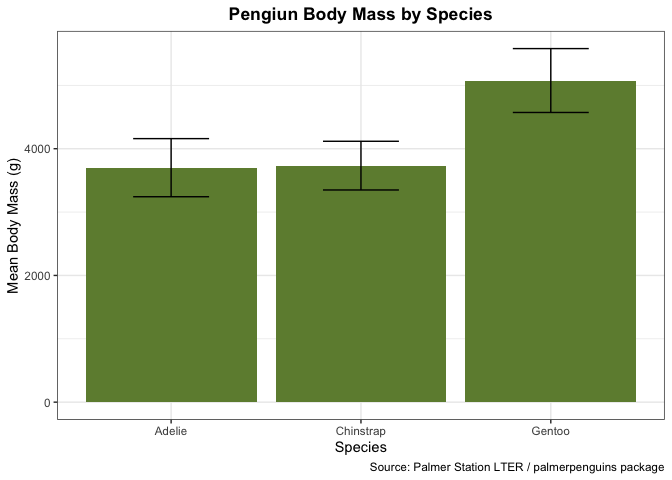
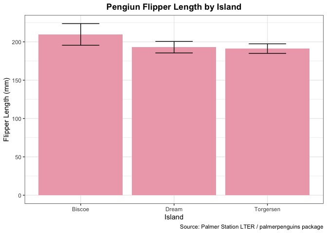

Homework 9A
================
Shelbie Ishimaru
2024-10-24

In this document we will be practicing writing functions. We will be
creating two function to help us optimize our data analysis and plotting
goals.

#### Load Libraries

First let’s load libraries that will let us accomplish our goals.

``` r
library(tidyverse) #for data manipulation
library(palmerpenguins) #our data
```

#### Functions

This first function will clean the data and calculate the mean and
standard deviation for a given variable. Obtaining the mean and standard
deviation will provide useful columns for plotting!

``` r
data_prep <- function(data= penguins, x, y) { #create function and specify parameters
    data %>% #call data
  group_by({{x}}) %>% #groups by our desired variables species, sex, and island
  summarize(mean= mean({{y}}, na.rm= T), #calculates the mean body mass
            sd= sd({{y}}, na.rm= T)) #calculate the standard deviation
}
```

The second function will plot the outputs of our first function!

``` r
peng_plot <- function(data, x, y, sd, labs, col) { #create function and specify parameters
  ggplot(data= data, #call in new df with mean and sd calculations 
       aes(x= {{x}}, #x-axis is the different penguin species by sex
           y= {{y}})) + #color the bars by sex
  geom_col(fill= col) + #color bars with chosen color (in params)
  geom_errorbar(aes(ymin= {{y}}-{{sd}}, #creates the floor of the error bar
                      ymax= {{y}}+{{sd}}), #creates the ceiling of the error bar
                position= position_dodge(0.9), #makes error bars in the middle of each bar
                width= 0.4) + #changes size of error bars
  labs(x= labs[3], #x-axis label
       y= labs[2], #y-axis label
       title= labs[1], #plot title 
       caption= labs[4]) + #adds caption of where we got the data

  theme_bw() + #change theme so we have a white background with grey grid lines and black outline
  theme(axis.title= element_text(size= 11), #change axes text size
        plot.title= element_text(hjust= 0.5, #change title text size
                                 face= "bold"), #make title bold
        plot.caption.position = "plot") #make caption on the bottom right of the page
}
```

#### Analysis: Testing Functions

Now let’s test our first function!

``` r
test_set1 <- data_prep(x= species, y= body_mass_g) #test function 1 with test set 1 params
test_set1 #look at output of the test
```

    ## # A tibble: 3 × 3
    ##   species    mean    sd
    ##   <fct>     <dbl> <dbl>
    ## 1 Adelie    3701.  459.
    ## 2 Chinstrap 3733.  384.
    ## 3 Gentoo    5076.  504.

``` r
test_set2 <- data_prep(x= island, y= flipper_length_mm) #test function 1 with test set 2 params
test_set2 #look at output of the test
```

    ## # A tibble: 3 × 3
    ##   island     mean    sd
    ##   <fct>     <dbl> <dbl>
    ## 1 Biscoe     210. 14.1 
    ## 2 Dream      193.  7.51
    ## 3 Torgersen  191.  6.23

Finally, lets use our plotting function to create figures based on our
two test data sets!

``` r
plot1_lab <- c("Pengiun Body Mass by Species", "Mean Body Mass (g)", "Species", "Source: Palmer Station LTER / palmerpenguins package") #create a vector of plot labels
test_plot1 <- peng_plot(data= test_set1, x= species, y= mean, sd= sd, labs= plot1_lab, col= "darkolivegreen4") #run plot function on test data set 1
test_plot1 #look at plot!
```

<!-- -->

``` r
plot2_lab <- c("Pengiun Flipper Length by Island", "Flipper Length (mm)", "Island", "Source: Palmer Station LTER / palmerpenguins package") #create a vector of plot labels
test_plot2 <- peng_plot(data= test_set2, x= island, y= mean, sd= sd, labs= plot2_lab, col= "pink2") #run plot function on test data set 2
test_plot2 #look at plot!
```

<!-- -->
