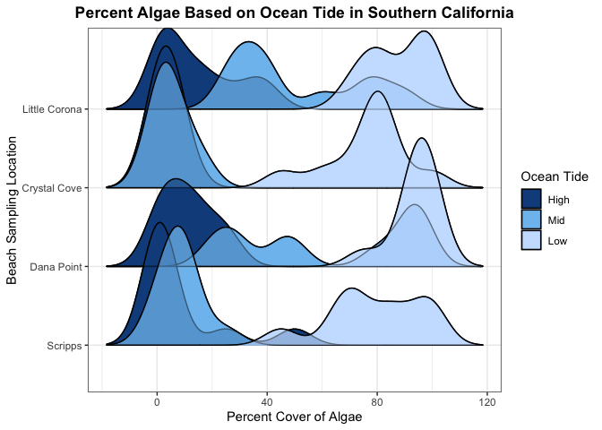

Homework 9B
================
Shelbie Ishimaru
2024-10-27

#### Load Libraries

``` r
library(tidyverse) #for data manipulation
library(here) #for unbreakable file paths
library(ggridges) #for creating ridge density plot
```

#### Read-in Data

``` r
intertidal <- read_csv(here("Week_09","Data", "intertidaldata.csv")) #read in inter-tidal data
glimpse(intertidal) #look at data
```

    ## Rows: 450
    ## Columns: 13
    ## $ Site                  <chr> "Scripps", "Scripps", "Scripps", "Scripps", "Scr…
    ## $ Transect              <dbl> 1, 1, 1, 2, 2, 2, 3, 3, 3, 4, 4, 4, 5, 5, 5, 6, …
    ## $ Quadrat               <chr> "Low  .", "Mid", "High", "Low", "Mid", "High", "…
    ## $ `Bare Rock`           <dbl> 25, 50, 20, 10, 40, 40, 0, 30, 60, 0, 45, 70, 5,…
    ## $ Algae                 <dbl> 75, 0, 50, 85, 5, 5, 100, 5, 4, 100, 10, 0, 70, …
    ## $ Mussels               <dbl> 0, 5, 1, 0, 10, 0, 0, 10, 1, 0, 3, 0, 0, 5, 0, 0…
    ## $ `Small Barnacles`     <dbl> 2, 50, 50, 0, 40, 55, 0, 40, 20, 0, 25, 25, 20, …
    ## $ `Large Barnacles`     <dbl> 5, 5, 0, 0, 1, 0, 1, 0, 0, 0, 15, 5, 5, 0, 0, 5,…
    ## $ `Gooseneck Barnacles` <dbl> 0, 0, 0, 5, 5, 0, 0, 30, 5, 0, 0, 0, 0, 0, 0, 0,…
    ## $ Anemone               <dbl> 3, 0, 0, 0, 0, 0, 0, 0, 0, 0, 5, 0, 0, 10, 0, 0,…
    ## $ `Whelks (Counts)`     <dbl> 0, 0, 0, 0, 0, 0, 0, 0, 1, 0, 0, 0, 0, 1, 0, 0, …
    ## $ `Crabs (Counts)`      <dbl> 0, 0, 0, 0, 0, 0, 0, 0, 0, 0, 0, 0, 0, 0, 0, 0, …
    ## $ `Stars (Counts)`      <dbl> 0, 0, 0, 0, 0, 0, 0, 0, 0, 0, 0, 0, 0, 0, 0, 0, …

``` r
intertidal_lat <- read_csv(here("Week_09","Data", "intertidaldata_latitude.csv")) #read in inter-tidal latitude data, so we can correctly factor the Site column 
glimpse(intertidal_lat) #look at data
```

    ## Rows: 15
    ## Columns: 2
    ## $ Site     <chr> "Starfish Point", "Cape Meares", "Fogarty Creek", "Cape Arago…
    ## $ Latitude <dbl> 47.65110, 45.47201, 44.83672, 43.30366, 41.99113, 41.78296, 3…

#### Data Manipulation

``` r
CA_tidal <- intertidal %>% #pull in inter-tidal data
  filter(Site== "Scripps" | #filter out to only 4 specific CA sites
           Site== "Dana Point" |
           Site== "Crystal Cove" |
           Site== "Little Corona") %>%
  mutate(Quadrat= recode(Quadrat, "Low  ."= "Low", #fix quadrat/tide values to be uniform
                         "Mid  1"= "Mid")) %>%
  mutate(Quadrat= factor(Quadrat, levels = c("High", #factor quadrat/tide column from high to low tide (for plotting legend)
                                             "Mid", 
                                             "Low"), ordered= T)) %>%
  mutate(Site= factor(Site, levels = c("Scripps", #factor the site column from lowest to highest latitude for plotting
                                       "Dana Point", 
                                       "Crystal Cove", 
                                       "Little Corona"), ordered= T))
```

#### Create Plot

``` r
cols <- c("dodgerblue4", "skyblue2", "lightsteelblue1") #color scheme for plot
#Plot 2: 
ggplot(CA_tidal, #use southern CA inter-tidal data
       aes(x= Algae, #x-axis is the percent cover of algae
           y= Site, #y-axis is the site
           fill= Quadrat)) + #fill by quadrat/tide level
  geom_density_ridges() + #make a density ridge plot
  theme_ridges() + #make a density ridge plot
  labs(x= "Percent Cover of Algae", #add x-axis label
       y= "Beach Sampling Location", #add y-axis label
       title= "Percent Algae Based on Ocean Tide in Southern California", #add title
       fill= "Ocean Tide") + #add legend title
  theme_bw() + #change theme so we have a white background with grey grid lines and black outline
  theme(axis.title= element_text(size= 11), #change axes text size
        plot.title= element_text(hjust= 0.5, #change title text size
                                 face= "bold")) + #make title bold
  geom_density_ridges(alpha = 0.5) + #make ridges transparent
  scale_fill_manual(values = cols) #use color scheme
```

<!-- -->
